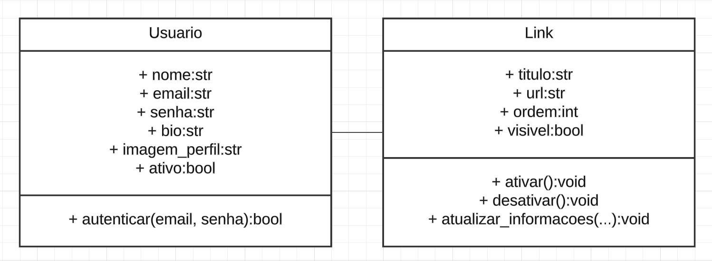

# Linkhoot

Linkhoot é um sistema simples de gerenciamento de links para usuários. Permite criar uma conta, adicionar links personalizados, ativar ou desativar links e visualizar o status dos links cadastrados.

## Funcionalidades

- Criar usuário com nome, email, senha, bio e imagem de perfil.
- Autenticar usuário via email e senha.
- Adicionar links com título, URL, ordem e visibilidade.
- Listar todos os links cadastrados mostrando título, URL e status (visível ou desativado).
- Ativar todos os links desativados.
- Desativar links específicos.
- Menu interativo via terminal.

## 🖼️ Visão geral

## Estrutura do projeto

- `usuario.py`: Contém a classe `Usuario` com atributos do usuário e métodos para autenticação.
- `link.py`: Contém a classe `Link` com atributos do link e métodos para ativar, desativar e atualizar links.
- `main.py`: Contém o menu principal e a interação com o usuário via terminal.

## Requisitos

- Python 3.x

---

### Autor

Leandro Freitas - leandrosanfreitas@gmail.com
